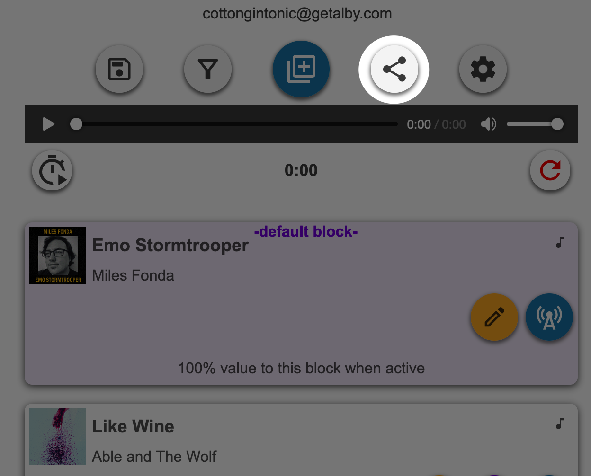
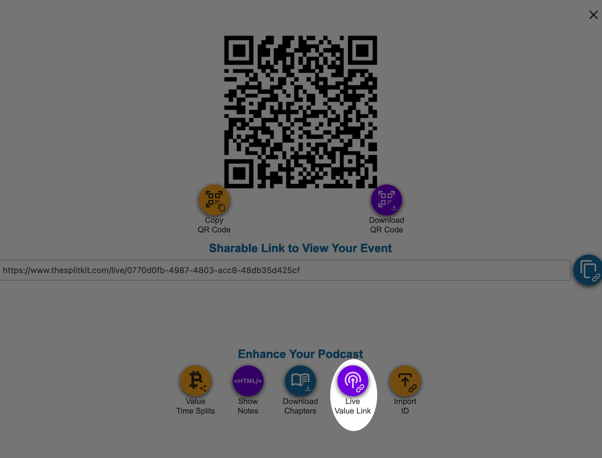
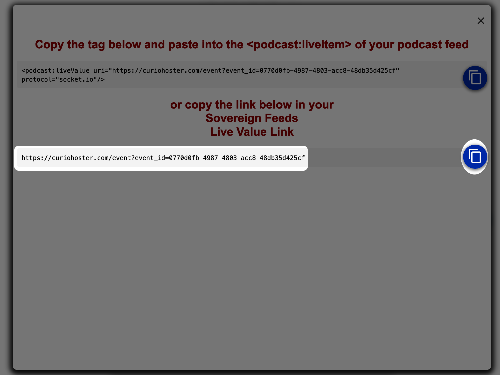

## Splitkit relay

Simple IRC bot that relays messages from https://thesplitkit.com


### Installation

#### Requirements:
- [Python 3.11.2](https://python.org)
- [asif 0.3.2](https://github.com/minus7/asif)
- [python-dotenv 1.0.0](https://github.com/theskumar/python-dotenv)
- [YOURLS](https://github.com/YOURLS/YOURLS) or some other URL shortening service
    - this project was built and tested against `YOURLS`, so if you use something else you will likely need to modify this code

From your terminal, and in whichever directory you would like to save and run from:
```
git clone --depth 1 https://github.com/cottongin/splitkit-relay.git
```
Then copy, move, or rename the `sample.env` file to `.env` and open it in your preferred file editor, making sufficient changes to the default values

#### thesplitkit.com setup
Now head on over to [thesplitkit](https://thesplitkit.com) and login to your account.

Once you've created an event click the `share` button

Now click the `Live Value Link` button

Finally, copy the bare Live Value Link or copy button


You can either paste this URL into your `.env` file, or you can tell the bot to connect to it via IRC and the command ``​`connect URL``

Now run
```bash
python main.py
```
The bot should connect to IRC if you've configured everything in your `.env` file correctly and join whichever channel(s) you've defined.

If you provided the URL in your `.env` file the bot should immediately start listening to your splitkit event and emit at least one message if you've already started said event.

Otherwise, as previously mentioned, send the ``​`connect`` command with your copied splitkit websocket URL.

## Bot commands
| Command            | Description                                           | Admin-only? |
| ------------------ | ----------------------------------------------------- | ----------- |
| ``​`join #channel`` | This tells the bot to `/join #channel`                | Yes         |
| ``​`part``          | This tells the bot to leave whatever you send it from | Yes         |
| ``​`connect URL``   | This tells the bot to connect to the websocket URL provided | Yes   |
| ``​`disconnect``    | This tells the bot to disconnect from the active websocket | Yes    |
| ``​`reload``        | This tells the bot to reload its configuration (`.env`)                | Yes         |
| ``​`np``            | This emits the last message received from the websocket               | **No**      |
| ``​`quit``          | This tells the bot to shutdown and quit                | Yes         |

----    
#### Troubleshooting
There is very minimal logging, most errors are just printed to `stdout`

----
Special thanks to [StevenB](https://github.com/thebells1111) for creating and maintaining [The Split Kit](https://thesplitkit.com)